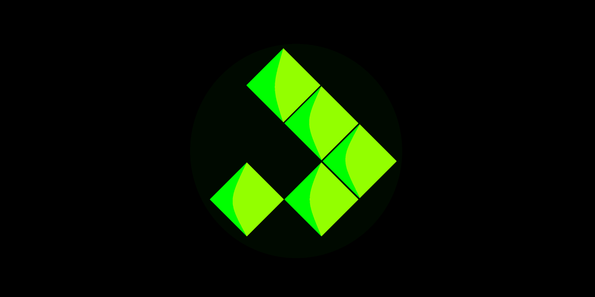

# WebAssembly Game of Life

This project implements Conway's Game of Life using Rust and WebAssembly, rendered with WebGL for high-performance simulation and visualization.

## Features

- Rust implementation of Game of Life rules
- WebAssembly compilation for fast execution in the browser
- WebGL rendering for efficient graphics
- Interactive controls (play/pause)
- FPS counter and performance metrics
- Responsive dark-themed UI

## Project Structure

- `lib.rs`: Rust implementation of the Game of Life logic
- `index.js`: JavaScript entry point for the application
- `index.html`: HTML structure and styling for the web interface
- `render.js`: WebGL rendering logic (not provided, but referenced)
- `webgl.js`: WebGL initialization (not provided, but referenced)
- `controls.js`: UI control setup (not provided, but referenced)
- `fps.js`: FPS calculation and display (not provided, but referenced)

## Prerequisites

- Rust
- wasm-pack
- Node.js and npm

## Building and Running

1. Compile the Rust code to WebAssembly:
   ```
   wasm-pack build
   ```

2. Install JavaScript dependencies:
   ```
   npm install
   ```

3. Start the development server:
   ```
   npm run start
   ```

4. Open your browser and navigate to `http://localhost:8080` (or the port specified by your development server).

## Usage

- Click the play/pause button to start or stop the simulation.
- Toggle the FPS table to view detailed performance metrics.

## Customization

You can modify the simulation parameters in `lib.rs`:

- Change the grid size by adjusting the `width` and `height` in the `Universe::new()` call.
- Modify the initial cell pattern in the `Universe::new()` method.

## Performance

The simulation uses several optimization techniques:

- Double buffering in the Rust code for efficient state updates
- WebGL for fast rendering of large numbers of cells
- WebAssembly for near-native performance of the simulation logic

## Contributing

Contributions are welcome! Please feel free to submit a Pull Request.

## License

This project is open source and available under the [MIT License](LICENSE).
